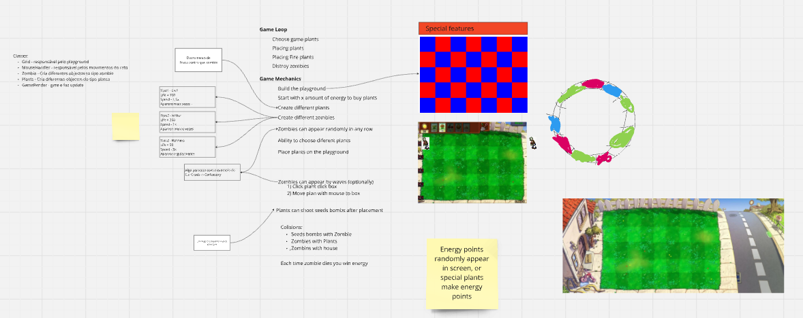

# Context

The Goal was to get familiar with an external graphics library also with user inputs. For this as a team we choose to replicate a very played game - plats vs zombies.

## Goal

Deliver an MVP solution, that allowed us to go through the process of designing a game from coming up with an idea, programming user input (either keyboard or mouse input) and all the way until packaging it in a JAR file for others to play. This full path is not only about programming from zero, is also understand how to incorporate an external library into your project.

## Requirements

 - This project should be in a specific git repository on GitHub and ensuring that each step along the way has commits;
 - Define clear roles and responsibilities per each element group;
 - Build a game UML that help on splitting program and development tasks;
 - Work together per task if possible use pair programming;

## Roadmap

1. Define the roles in our group and how is the gatekeeper for git , playing the git master role;  
2. As a next step started building the GitHub repository. It's a simple task, that was successfully done by following the standard git New Repository function. 
3. Each team member made each git repository local clone to have their own local files to work.  
4. After this we looked to the challenge itself and understand how the game could be split to allow us to move step by step into an incremental approach. To facilitate this process we used a Miro Whiteboard. 
 - 
5. 

we chose one that was playing the role of the gatekeeper ensuring that all work matches and avoiding any conflict. Overseeing the development process, managing merges, and ensuring that changes are correctly integrated into the main codebase our git master.
 
After creating the idea of the game and a UML together, divide the tasks between people: for instance, some people deal with the logic of the game, and others — with the representation/graphical part. Meet frequently to ensure everyone is aligned and not blocked on something easily solved by talking to the whole group.

Establish objectives (e.g., “create a game menu, due tomorrow”) and divide the tasks (for instance, “create the list of commands available in the menu”) between pairs or trios. Each pair/trio can work on a task, like when you were pair programming.